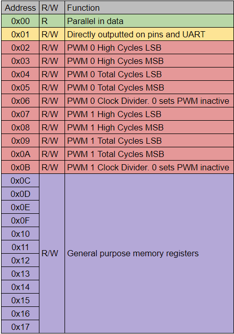
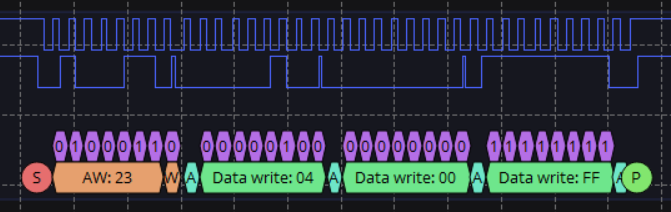
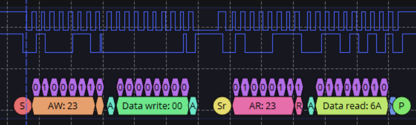

# I2C Peripheral Device

Owen Ball
18-224/624 Spring 2023 Final Tapeout Project

## Overview

An I2C peripheral device with 20 8-bit registers. The device has one read only register
set to the value of 8 parallel inputs. The value of one register is outputted as a
parallel output. The device also features two PWM outputs controlled using the registers.

# Design Specifications 

## Clock Speed
In order for proper function of the I2C line, the input clock should be approximately 10 to 15 times the frequency of the bus. To operate at the standard I2C clock speed of 100kHz, a clock of at least 1MHz should be used.
## Inputs/Outputs

This design takes in a clock, active high reset, and has the following IO:

| Number  | Inputs  | Outputs  |
| :---:   |  :----: |  :---:   |
| 0       |   SCL   |  SDA_N   |
| 1       |   SDA   |  UART_TX |
| 2       |  ADDR_0 |  PWM_0   |
| 3       |  ADDR_1 |  PWM_1   |
| 4       |  D0_IN  |  D0_OUT  |
| 5       |  D1_IN  |  D1_OUT  |
| 6       |  D2_IN  |  D2_OUT  |
| 7       |  D3_IN  |  D3_OUT  |
| 8       |  D4_IN  |  D4_OUT  |
| 9       |  D5_IN  |  D5_OUT  |
| 10      |  D6_IN  |  D6_OUT  |
| 11      |  D7_IN  |  D7_OUT  |

The inputs consist of the SCL line, the SDA line, 2 address select lines, and 8 input pins. The data pins directly map to the read-only register 0x00 as shown in the register map below.The address pins indicate the desired I2C address of the design. The table below shows the address that corresponds to each combination of these pins.

| ADDR_1, ADDR_0 | I2C Address |
| :---:  | :---:   |
| 0,0    | 0x20    |
| 0,1    | 0x21    |
| 1,0    | 0x22    |
| 1,1    | 0x23    |

The first output is SDA_N, which is the inverted SDA output of the chip, which
should then be connected to the gate of an NMOS to pull the SDA line to ground.
The chip also has two PWM outputs and a UART output. The functionality of these pins will be discussed in later sections. The last set of outputs is the 8-bit value stored in register 0x01 on the design.

## Register Map

The design consists of 20 registers. 

- Register 0x00 is a read only register set to the value on the inputs D0_IN - D7_IN

- Register 0x01 is directly outputted onto D0_OUT - D7_OUT

- Registers 0x02-0x0B are used for controlling the PWM pins. However, they can be used
as memory registers if the PWM outputs are ignored or the PWM divider is set to 0.

- Registers 0x0C-0x13 are not assigned to any function and can be used as volatile I2C memory

 UPDATE

<table>
  <tr>
    <th>Header 1</th>
    <th>Header 1</th>
    <th>Last</th>
  </tr>
<tr style="background-color:red">
    <td>First</td>
    <td>Second</td>
    <td>Third</td>
  </tr>
  <tr style="background-color:blue">
    <td>First</td>
    <td>Second</td>
    <td>Third</td>
  </tr>
  <tr style="background-color:green">
    <td>Another</td>
    <td>Thing</td>
    <td>Here</td>
  </tr>
</table>

## UART TX
The value in register 0x01 is continuously sent on output pin 1. 8 bits are sent per transmission with no parity bit. The line is held high for 7 bits worth of time before the next start bit is sent.

The baud rate can be determined by dividing the clock speed of the design by 52. For a 1MHz clock, this corresponds to 19200 baud, and for a 500kHz clock, this corresponds to 9600 baud.

## PWM
The design features two PWM outputs, each controlled by 5 registers. For each PWM output.
- The 'High Cycles' registers correspond to the number of clock cycles that the PWM output will be high for. 
- The 'Total Cycles' registers correspond to the number of clock cycles in one period of the PWM signal. If this value is lower than 'High Cycles,' the output will be held high.
- The clock divider register will be multiplied by the high time and period to allow for longer period PWM signals. Setting this register to 0 will deactivate the PWM output.     

## Writing to Registers
In order to write to a register, the coordinator device should first send the I2C device address, followed by the target register, then the data to store to the register. If multiple bytes of data are provided, the target register will be incremented by 1 for each byte sent. This will wrap around to address 0x00, although it is not recommended to make use of this functionality. Address 0x00 is read only and will ignore attempts to write to it.

An example transmission is shown below, where the device (address 0x23) has the bytes 0x00 and 0xFF written to registers 0x04 and 0x05.

## Reading From Registers
In order to read from a register, the coordinator should first write the desired register address to the I2C device address. A repeated start condition should then be used, after which the I2C device address should be sent again, this time with the read/write bit set to read. The device will then send the data stored in the specified register. The device will continue to send the values stored in subsequent registers until a stop condition is sent. This will wrap around to register 0x00.

An example transmission is shown below, where the value of 0x6A is read from register 0x00 of the I2C device (0x23).

## Hardware Peripherals

Both the Ice40 FPGA and the ASIC do not support leaving outputs as high impedance. As a result, in order to drive the SDA line, the SDA_N output of the chip must be fed into an NMOS with a pull-up resistor. The drain of the NMOS should then be connected to SDA. Thus when SDA_N is high, SDA is pulled to ground and otherwise, is pulled to 3.3V. The resistor value should be somewhere in the range of 2kOhm to 10kOhm, with the NMOS being capable of switching fast enough for the desired I2C speed and being able to overpower the SDA pull up resistors. Note that this chip does not perform clock stretching and as such, has no need to drive the SCL line. 

## How it Works

(deeper description of your project's internal operations, along with any diagrams. large parts of this can likely be copied from your project design plan and/or RTL checkpoint submission)

To add images, upload them into the repo and use the following format to embed them in markdown:

## Design Testing / Bringup

(explain how to test your design; if relevant, give examples of inputs and expected outputs)

(if you would like your design to be tested after integration but before tapeout, provide a Python script that uses the Debug Interface posted on canvas and explain here how to run the testing script)

## Media

(optionally include any photos or videos of your design in action)

## (anything else)

If there is anything else you would like to document about your project such as background information, design space exploration, future ideas, verification details, references, etc etc. please add it here. This template is meant to be a guideline, not an exact format that you're required to follow.
